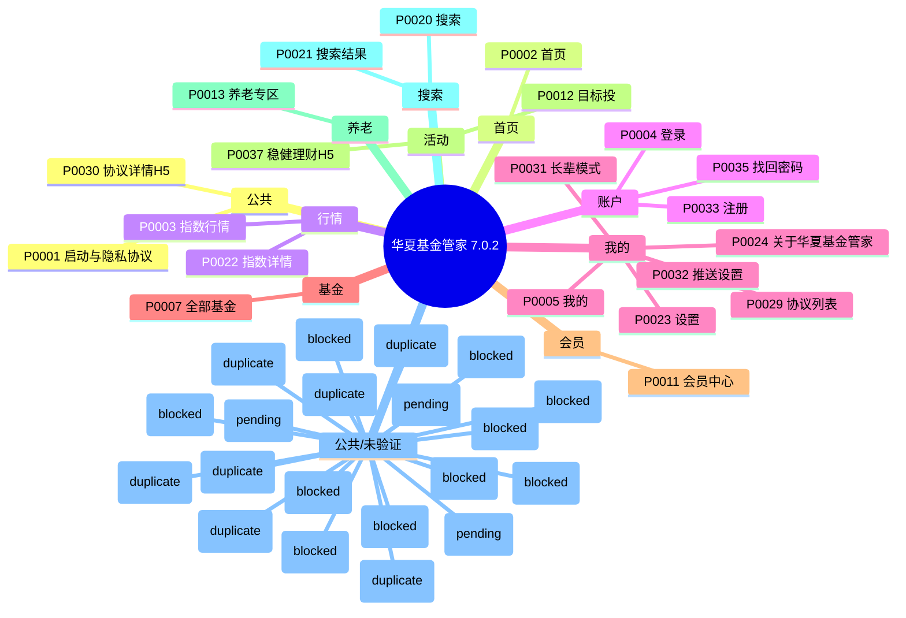

# APP_MINDMAP.md — App 信息架构思维导图

```mermaid
mindmap
  root((华夏基金管家 7.0.2))
    公共
      P0001 启动与隐私协议
      P0030 协议详情H5
    首页
      P0002 首页
    行情
      P0003 指数行情
      P0022 指数详情
    账户
      P0004 登录
      P0033 注册
      P0035 找回密码
    我的
      P0005 我的
      P0023 设置
      P0024 关于华夏基金管家
      P0029 协议列表
      P0031 长辈模式
      P0032 推送设置
    基金
      P0007 全部基金
    会员
      P0011 会员中心
    活动
      P0012 目标投
      P0037 稳健理财H5
    养老
      P0013 养老专区
    搜索
      P0020 搜索
      P0021 搜索结果
    公共/未验证
      P0006 首页快捷区-全部基金跳转过渡 (duplicate)
      P0008 基金详情 (blocked)
      P0010 我的自选 (blocked)
      P0014 Android 桌面（误触） (duplicate)
      P0015 意见反馈 (blocked)
      P0016 常见问题 (pending)
      P0017 投顾解约 (pending)
      P0018 相关协议 (pending)
      B0024 关于华夏基金管家（旧编号） (duplicate)
      B0026 注册（旧编号） (duplicate)
      B0027 忘记密码（旧编号） (duplicate)
      B0028 交易记录 (blocked)
      B0029 银行卡管理 (blocked)
      B0030 长辈模式（旧编号） (duplicate)
      B0031 消息推送/个性化设置（旧编号） (duplicate)
      P0034 基金详情 (blocked)
      P0036 基金购买/赎回/转换/定投流程 (blocked)
      P0038 实名认证/开户/风险测评 (blocked)
      P0039 持仓/收益/交易记录（登录后） (blocked)
      P0040 消息通知/客服中心/帮助中心 (blocked)
```
