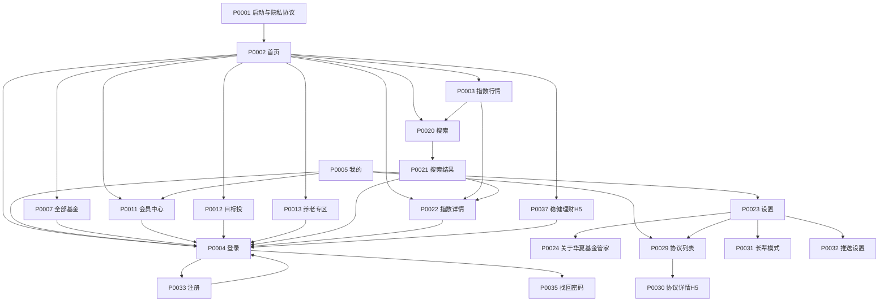

# PAGE_RELATIONSHIPS.md — 页面跳转关系图

```mermaid
flowchart TD
  P0001["P0001 启动与隐私协议"]
  P0002["P0002 首页"]
  P0003["P0003 指数行情"]
  P0004["P0004 登录"]
  P0005["P0005 我的"]
  P0007["P0007 全部基金"]
  P0011["P0011 会员中心"]
  P0012["P0012 目标投"]
  P0013["P0013 养老专区"]
  P0020["P0020 搜索"]
  P0021["P0021 搜索结果"]
  P0022["P0022 指数详情"]
  P0023["P0023 设置"]
  P0024["P0024 关于华夏基金管家"]
  P0029["P0029 协议列表"]
  P0030["P0030 协议详情H5"]
  P0031["P0031 长辈模式"]
  P0032["P0032 推送设置"]
  P0033["P0033 注册"]
  P0035["P0035 找回密码"]
  P0037["P0037 稳健理财H5"]
  P0001 --> P0002
  P0002 --> P0003
  P0002 --> P0004
  P0002 --> P0007
  P0002 --> P0011
  P0002 --> P0012
  P0002 --> P0013
  P0002 --> P0020
  P0002 --> P0022
  P0002 --> P0037
  P0003 --> P0020
  P0003 --> P0022
  P0004 --> P0033
  P0004 --> P0035
  P0005 --> P0004
  P0005 --> P0011
  P0005 --> P0023
  P0005 --> P0029
  P0007 --> P0004
  P0011 --> P0004
  P0012 --> P0004
  P0013 --> P0004
  P0020 --> P0021
  P0021 --> P0004
  P0021 --> P0022
  P0022 --> P0004
  P0023 --> P0024
  P0023 --> P0029
  P0023 --> P0031
  P0023 --> P0032
  P0029 --> P0030
  P0033 --> P0004
  P0037 --> P0004
```

